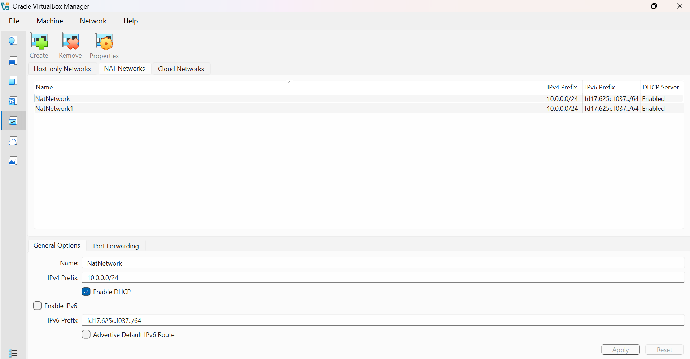

<div align="center">

#  Cybersecurity Lab Environment Setup

**Building an isolated virtual lab for penetration testing and ethical hacking practice**
</div>

<p align="center">
  
  
  
  
  
  
  
  
  
  
  
  
</p>
---

##  Project Overview

This project focuses on setting up a **virtual cybersecurity and penetration-testing laboratory** using VirtualBox and Kali Linux.

The purpose of the lab is to create a controlled environment where cybersecurity tools, network scanning, reconnaissance, vulnerability assessment, and other security-testing activities can be performed safely and repeatedly.

The lab is configured on a private virtual network so that additional machines can be added later and used as targets for authorized security testing.

---##  Objectives

The main objectives of this project are to:

- Install and configure VirtualBox.
- Install/import Kali Linux as a virtual machine.
- Create a private **NAT Network** for the cybersecurity lab.
- Configure network connectivity for Kali Linux.
- Assign a consistent IP address to the Kali VM.
- Verify network connectivity and DNS resolution.
- Take a clean VM snapshot for recovery.
- Document the complete setup process.
- Prepare the environment for future cybersecurity projects.

---

## 🛡️ Purpose of the Lab

The lab provides an isolated and controlled environment for cybersecurity learning and authorized security testing.

It can be used for activities such as:

- Network reconnaissance
- Port scanning
- Vulnerability assessment
- Packet analysis
- Web security testing
- Exploitation practice
- Security-tool experimentation

⚠️ **Important:** This laboratory must only be used for systems that you own or have explicit permission to test. Do not use the lab or its tools to attack unauthorized systems.

---## Lab Architecture

Additional target machines can be added to the same virtual network in future projects.

---

##  Lab Configuration

| 🧩 Component       | ⚙️ Configuration   |
| ------------------ | ------------------  |
| 🖥️ Host OS         | Windows 10         |
| 🧠 Host RAM        | 8 GB               |
| ⚡ Processor       | Intel Core i7      |
| 🧰 Hypervisor      | VirtualBox 7.2  |
| 🐉 Security OS     | Kali Linux 2026.2  |
| 🧠 Kali RAM        | 2048 MB            |
| 🌐 Virtual Network | NAT Network        |
| 📡 Network Address | 10.0.0.0/24        |
| 🐧 Kali IP Address | 10.0.0.2/24        |
| 🚪 Default Gateway | 10.0.0.1           |
| 🌍 DNS Server      | 8.8.8.8            |
| 🔮 Future VM Range | 10.0.0.3–10.0.0.99 |
---

#  Lab Setup Procedure

##Step 1. Install 7-Zip

7-Zip was installed to extract the Kali Linux virtual-machine package, which may be distributed as a `.7z` archive.

*Tool:* 7-Zip

---

##Step 2. Install VirtualBox

VirtualBox was installed as the hypervisor.

---

##Step 3. Create the NAT Network

A dedicated NAT Network was created in VirtualBox.

Configuration:
Network Name: NatNetwork
IPv4 Prefix:  10.0.0.0/24
DHCP:         Enabled
IPv6:         Disabled




A **NAT Network** was selected to establish a controlled virtual networking environment because multiple virtual machines connected to the same NAT Network can communicate with one another while also having outbound network connectivity.
This provides isolated yet interconnected environment required for simulating realistic attacker target interaction.

---

##Step 4. Import Kali Linux

The Kali Linux virtual machine was downloaded from the official Kali Linux website and imported into VirtualBox.

The VM network adapter was configured as follows:

```text
Adapter 1
Attached to: NAT Network
Network:     NatNetwork
Adapter Type: Intel PRO/1000 MT Desktop
```

The VM was allocated:

```text
RAM: 2048 MB
```


---

##step 6. Create a Clean VM Snapshot

After completing the initial configuration, a VirtualBox snapshot was created.

Example snapshot name:

```text
Clean Kali - Network Setup
```

The snapshot represents the clean baseline of the laboratory.

If a future exercise changes or damages the VM configuration, the machine can be restored to this baseline.


---

## Lab Verification

| ✅ Test                        | 🧾 Command                      | 🎯 Expected Result              |
| ----------------------------- | ------------------------------- | ------------------------------- |
| 🌐 Check IP address           | `ip a`                          | Correct Kali IP displayed       |
| 📡 Test gateway               | `ping 10.0.0.1`                 | Successful replies              |
| 🌍 Test Internet connectivity | `ping 8.8.8.8`                  | Successful replies              |
| 🔎 Test DNS resolution        | `nslookup networkwalks.com`     | Domain resolves                 |
| 🧰 Verify Nmap                | `nmap --version`                | Nmap version displayed          |
| 🔄 Verify snapshot            | Restore snapshot and run `ip a` | Baseline configuration restored |

### Example Results

```text
IP Address:
10.0.0.2/24

Gateway:
10.0.0.1

DNS:
8.8.8.8
```
# Problems Encountered & Solutions

Documenting problems is an important part of the project.

## Problem 1. VirtualBox Installation Issue

VirtualBox initially required additional Microsoft Visual C++ components before installation could proceed properly.n.

Resolution: The required Visual C++ components were installed, after which VirtualBox installed and launched successfully.

## Problem 2. Kali Linux Virtualiztion Error

Kali Linux initially failed to start because hardware virtualization was disabled.T

Resolution:Virtualization Technology(VTx) was enabled in the system BIOS, allowing Kli Linux to boot successfully.
1. Restarting the computer.
2. Entering BIOS/UEFI settings.
3. Enabling Intel VT-x / hardware virtualization.
4. Saving the configuration.
5. Restarting the computer.
6. Starting the Kali VM again.

## Problem 3. Kali Linux Network Connectivity Issue

The Kali Linux  Ethernet interface initially appeared disconnected, preventing the virtual machine from accessing the network.

Resolution: The Ethernet interface was manually enabled using the command:
sudo ifconfig eth0 up
This brought the interface up and restored network connectivity.

##What I Learned##

Through this project, I learned how to create and configure a virtual environment for cybersecurity practice.

The most important concepts I learned include:

### 1. Virtualization Fundamentals

I gained a practical understanding of how VirtualBox can be used to create and manage isolated virtual machines for cybersecurity experimentation.

### 2. Virtual Machine Configuration

I learned how to import, configure, start, stop, and manage a Kali Linux virtual machine , including understanding the roles of .vbox configuration and.vdi virtual disk files.  and verify IPv4 addressing, subnet masks, gateways, and DNS settings in Kali Linux.

### 3. Virtual Networking

I developed an understanding of NAT Networks and how they provide a controlled environment where multiple virtual machines can communicate while maintaining outbound network connectivity. 

### 4. Technical Troubleshooting

The setup strengthened my ability to diagnose configuration errors systematically rather than relying solely on on trial and error.

### 5. Cybersecurity Lab Preparation:

I gained a clearer understanding of how virtualization and network configuration form the foundation for building an isolated environment for future attacker target cybersecurity exercises.

### 6.Documentation:

I learned the importance of recording configuration decisions, challenges, solutions, and technical commands used throughout the lab, making the process easier to review, reproduce, and troubleshoot.

---

# Security & Ethical Use

This laboratory is intended strictly for education purposes only.

---

## Tools & Resources

**7-Zip:** [https://7-zip.org/download.html](https://7-zip.org/download.html)
- **VirtualBox:** [https://virtualbox.org/wiki/Downloads](https://virtualbox.org/wiki/Downloads)
- **Kali Linux:** [https://kali.org/get-kali](https://kali.org/get-kali)
---

## Author

**Chibueze Ifeoma Increase**\
Cybersecurity Professional B085

LinkedIn: (https://www.linkedin.com/in/ifeoma-chibueze-9774a4406)

---

## Project Information

**Program Name:** Cybersecurity at Networkwalks | **Week:** 01 | **Project:** Cybersecurity & Pentesting Lab Setup | **Repository:** GitHub
